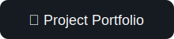

# Hello there, I'm Sascha

<!--
**Bongni/Bongni** is a ✨ _special_ ✨ repository because its `README.md` (this file) appears on your GitHub profile.

Here are some ideas to get you started:

- 🔭 I’m currently working on ...
- 🌱 I’m currently learning ...
- 👯 I’m looking to collaborate on ...
- 🤔 I’m looking for help with ...
- 💬 Ask me about ...
- 📫 How to reach me: ...
- 😄 Pronouns: ...
- ⚡ Fun fact: ...
-->

🎓 I’m a student at ETH Zürich, specializing in Systems Programming, Machine Learning and Networking.

## Interests

⚙️ I’m passionate about Operating System design, low-level optimization, parallelization, networking and embedded systems programming.

🔬 I have worked on Large Language Models (LLMs), Reinforcement Learning and Active Learning, where I explored how intelligent systems can learn more efficiently.

🛡️ In my freetime I like to study Cyber Security by solving CTFs.

## Experience

  💻 I primarily code in C/C++ and Python.
  
    
    
  

## Projects

🚀 Feel free to reach out or check out my projects below!

 

    

